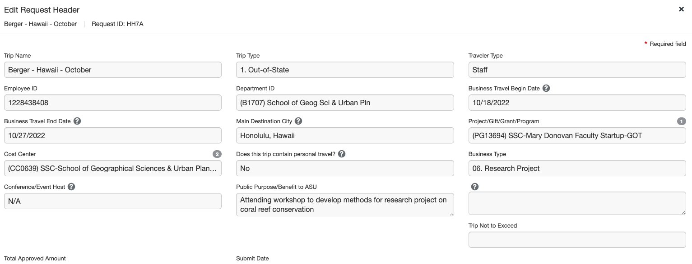
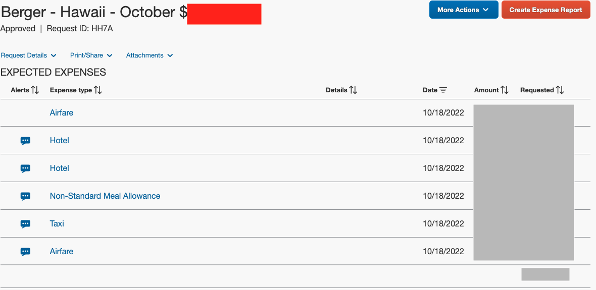
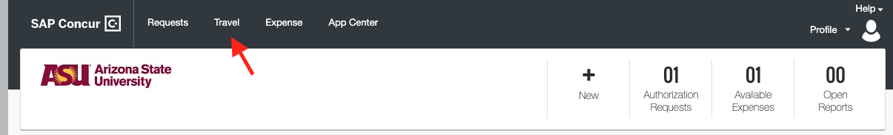

# Travel Protocols

This document is to outline the process of planning, booking and completing any travel you take as part of the lab. 

ASU uses the Concur travel system, which you can login to [here](https://myasutrip.asu.edu/login) with your MyASU id and password. Additional resources from ASU regarding travel can be found [here](https://cfo.asu.edu/myasutrip). 

### Creating a Travel Request

1. Before you book any travel, you must first create a new travel request. You can do this by clicking on the Request button at the top of the Concur homepage, and then clicking the "+ create new request" button.

2. You will be asked to fill out the "header" of the request. For simplicity, create a name that includes your last name, the destination and the month. (dept, cost center, buisness type, prpupose). 
*Note*: The Department ID, Cost Center and the Project/Gift/Grant/Program should always be the same as the ones shown here.

3. The next step is to add estimated expenses to the request. You should add flights, hotels, food and any other ground transportation you might need (ie taxis or buses to the airport). You may not know exactly how much everything will cost at this point - as a general rule of thumb, enter the maximum you think you will spend. You can always spend less than you request.
  - **Hotel costs**: Use the Department of Defense maximum lodging per diem for the location you are traveling - you can find that on this website [here](https://www.travel.dod.mil/Travel-Transportation-Rates/Per-Diem/Per-Diem-Rate-Lookup/). Multiply this rate by number of days you are staying in that location.
  - **Flight costs**: All ASU travel must be booked through Concur. Therefore, to get an estimate of your flights, use the travel tab to input your planned departure dates and cities. Take a look at the options to get an idea of how much it will cost and input this into your flight estimate.
  - **Food costs**: You can estimate your food costs with just one expense line: select "Non-standard meal allowance", and then input how much you think you will spend per day times the number of days you'll be there. $50 is a generally a pretty good estimate.

4. Once you've entered all expense estimates, click on "Request Details" in the top left corner, and then "Request Timeline" in the drop-down menu. This will take you to a page where you can request the the Cost Center manager. You'll want to input "Angelene C. Capello" - start typing Capello in the search bar and it should appear as an option. 

5. Take a screen shot of this page and send it to Mary

6. Once Mary approves, you can go ahead and submit the request

### Booking Travel

Once your request is approved, you can go ahead and book your flights and hotels through Concur.

#### Flights 
 
1. Start by heading to the travel tab 

2. Search for flights using the form on the left hand side. Once you find one, you'll walk through the booking process within Concur. You eventually will be asked for the 4 digit request ID from your expense request. Also, make sure to not check the box asking if this is a federal grant (its not). Before you confirm the flight, you can hold the reservation for a day if you have questions for Mary or others.

#### Hotels

Hotels can be booked outside of Concur (often times cheaper and more flexible to do so). You will have to use your own payment method, but you will be reimbursed. Once you've booked the hotel, send a message to MyASUTRIP@exchange.asu.edu with the subject line: **Lodging Booked Outside of Concur**. Let them know the 4 digit request ID, the amount and attach the confirmation receipt. 

*Note: For travel to Oahu or Hawai'i, ASU has a contract with the Price Hotel which has locations on both islands. If the dates you are travelling are available, ask for the group code and book outside of Concur*

### Travel Completion

